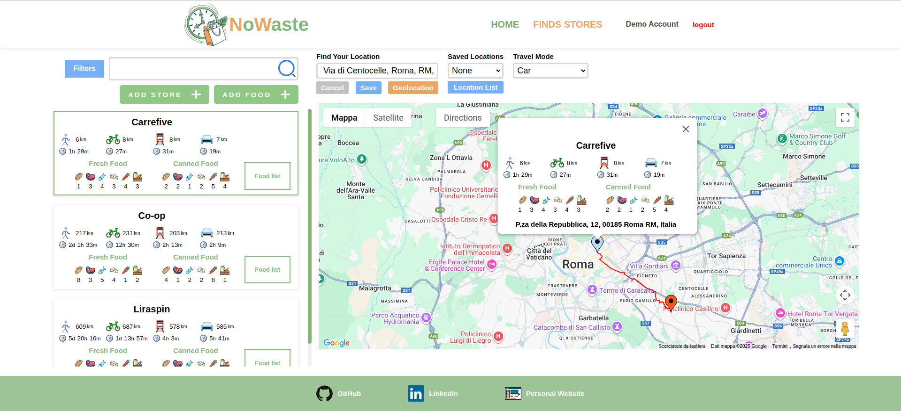

<h1>no-waste</h1>

Application that helps you find nearby stores offering discounted prices on foods that are close to their expiration date.

<a href="https://no-waste.netlify.app/" target="_blank">Link to the app website</a>

<h2>Architecture</h2>

    The backend of <strong>no-waste</strong> is built with a <strong>microservices architecture</strong>, where each service is responsible for a specific domain 
    (authentication, store, users). 
    All services are orchestrated through an <strong>API Gateway</strong>, which acts as a single entry point for the frontend. 
    This design improves scalability, flexibility, and security while keeping each service independent and easier to maintain.

<strong>High-level workflow:</strong>

<ol>
    <li>The <strong>frontend</strong> communicates only with the gateway.</li>
    <li>The <strong>gateway</strong> routes requests to the appropriate microservice (authentication, store, users).</li>
    <li>Each <strong>microservice</strong> interacts with the PostgreSQL database via Prisma.</li>
 </ol>

<pre>
Frontend (React) → API Gateway → Microservices (authentication, store, users) → Database (PostgreSQL/Neon)
</pre>

<h2>Features</h2>
<ul>
    <li>Register and login</li>
    <li>Use a demo account</li>
    <li>Add or remove shops and items</li>
    <li>View store locations on Google Maps</li>
    <li>Detect your current location using geolocation</li>
    <li>Save or delete your saved location</li>
    <li>See the route between your location and a chosen store</li>
    <li>View travel time and distance by car, walking, biking, or public transport</li>
    <li>Filter stores by name, shortest travel distance, or fastest travel time</li>
    <li>Filter items by name, type, price, expiration date, or days remaining before expiration</li>
</ul>

<h2>Technology Used</h2>
<ul>
    <li>HTML</li>
    <li>CSS</li>
    <li>JavaScript</li>
    <li>React</li>
    <li>Node.js</li>
    <li>Express</li>
    <li>Prisma</li>
    <li>PostgreSQL</li>
    <li>JSON Web Token (authentication)</li>
    <li>http-proxy-middleware (API Gateway)</li>
    <li>React Google Maps (map integration)</li>
</ul>

<h2>React Libraries</h2>
<ul>
    <li><a href="https://github.com/glennreyes/react-countup" target="_blank">react-countup</a> ( animated number counter )</li>
</ul>

<h2>Cloud Hosting Platforms</h2>

<ul>
    <li>Frontend: <a href="https://www.netlify.com/" target="_blank">Netlify</a></li>
    <li>Backend: <a href="https://fly.io/" target="_blank">Fly.io</a></li>
</ul>

<h2>Database Platform</h2>

<ul>
    <li><a href="https://neon.com/" target="_blank">Neon</a></li>
 </ul>

<h2>Credit</h2>

<h3>Images</h3>
<ul>
    <li>App logo created with<a href="https://www.svgai.org/" target="_blank"> SVG AI</a></li>
    <li><a href="https://it.freepik.com/foto-gratuito/varieta-di-verdure-biologiche-in-un-supermercato_18416366.htm#fromView=search&page=1&position=19&uuid=e14ef6d1-119a-48b6-b9ba-7240d0675308&query=grocery+store" target="_blank">Home Page image</a></li>
</ul>

<h3>SVG</H3>
<ul>
    <li><a href="https://www.svgrepo.com/svg/124393/bike" target="_blank">Bicycle</a></li>
    <li><a href="https://www.svgrepo.com/svg/480862/bus-stop" target="_blank">Bus</a></li>
    <li><a href="https://www.svgrepo.com/svg/476848/carpool" target="_blank">Car</a></li>
    <li><a href="https://www.svgrepo.com/svg/500082/train" target="_blank">Train</a></li>
    <li><a href="https://www.svgrepo.com/svg/528799/walking" target="_blank">Walk</a></li>
    <li><a href="https://www.svgrepo.com/svg/92170/not-available-circle" target="_blank">Not Available</a></li>
    <li><a href="https://www.svgrepo.com/svg/493485/shopping-cart" target="_blank">Shopping Cart (favicon)</a></li>
    <li><a href="https://www.svgrepo.com/svg/532195/menu" target="_blank">Dropdown Menu</a></li>
    <li><a href="https://www.svgrepo.com/svg/530223/bread" target="_blank">Bread</a></li>
    <li><a href="https://www.svgrepo.com/svg/530216/carrot" target="_blank">Carrot</a></li>
    <li><a href="https://www.svgrepo.com/svg/530210/fish" target="_blank">Fish</a></li>
    <li><a href="https://www.svgrepo.com/svg/404334/meat-food-eat-cooking-bbq" target="_blank">Meat</a></li>
    <li><a href="https://www.svgrepo.com/svg/270109/charity-supermarket" target="_blank">Other Foods</a></li>
    <li><a href="https://www.svgrepo.com/svg/378902/trash-bin" target="_blank">Trash Bin</a></li>
    <li><a href="https://www.svgrepo.com/svg/171674/time" target="_blank">Route Duration</a></li>
    <li><a href="https://www.svgrepo.com/svg/499761/search" target="_blank">Search</a></li>
    <li><a href="https://www.svgrepo.com/svg/218143/add-plus" target="_blank">Plus</a></li>
    <li><a href="https://www.svgrepo.com/svg/533621/arrow-sm-right" target="_blank">Arrow</a></li>
    <li><a href="https://www.svgrepo.com/svg/235536/co2" target="_blank">Co2</a></li>
    <li><a href="https://www.svgrepo.com/svg/485057/pig-piggy-bank" target="_blank">Piggy Bank</a></li>
    <li><a href="https://www.svgrepo.com/svg/485284/recycle" target="_blank">Recycle</a></li>
</ul>
